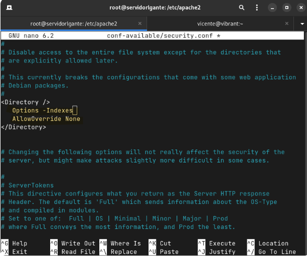

A continuación se explicará como instalar un servidor apache y securizarlo.

Un servidor Apache es un software de servidor web de código abierto ampliamente utilizado. Se trata de un servidor HTTP (Protocolo de Transferencia de Hipertexto) que permite entregar páginas web a los clientes que solicitan contenido a través de un navegador web.

## Paso 1 Instalar apache

Para instalar apache hay que poner el siguiente comando:

`sudo apt install apache2`

Luego comprobamos que la intalación ha salido bien con el siguiente comando:

`systemctl status apache2`

A continuación se adjunta una captura para verlo de manera visual:

Ya tendríamos instalado el servidor Apache2.

## Paso 2 Securizar Apache

Para securizar Apache hay que desactivar algunos ajustes del entorno de desarrollo, acontinuación se muestran los pasos a seguir mediante
imagenes.

Por defecto el servidor Apache devuelve información acerca de la máquina y la versión de Apache, lo desactivamos para no exponer información que pueda comprometer el servidor.

Clickjacking es una conocida vulnerabilidad de las aplicaciones web, prevenimos que otras páginas puedan ‘embedir’ la nuestra habilitando dicha opción.

En una instalación predeterminada, los usuarios pueden anular la configuración de Apache usando .htaccess. Para evitar que los usuarios puedan modificarlo agregamos AllowOverride a None como se muestra.

De forma predeterminada, el método de seguimiento está habilitado en el servidor web Apache. Tener esto habilitado puede permitir un ataque de rastreo de sitios cruzados y potencialmente dar una opción a un pirata informático para robar información de cookies.
