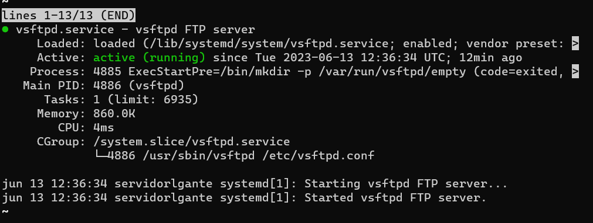
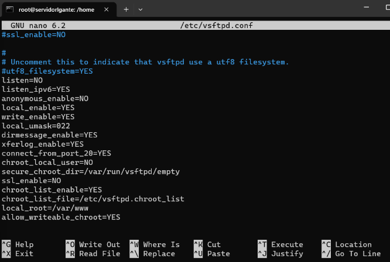
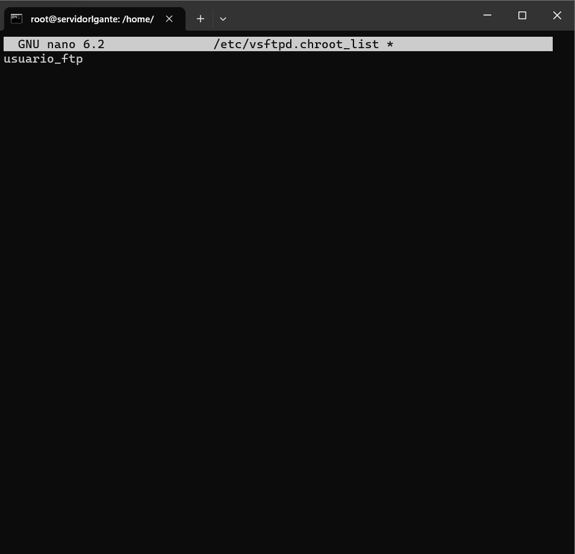
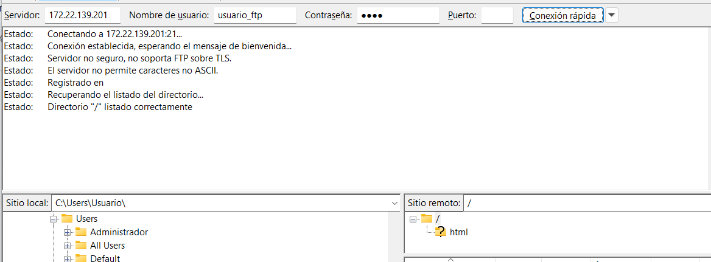

Un servidor **FTP** (File Transfer Protocol, por sus siglas en inglés) es un tipo de servidor utilizado para transferir archivos entre un cliente y un servidor a través de una red, como Internet. FTP es un protocolo estándar ampliamente utilizado para la transferencia de archivos y proporciona una forma rápida y confiable de transferir datos.

A continuación aprenderás a instalarlo y uno de los metodos para securizarlo.

## Paso 1 introducir el siguiente comando: 

`sudo apt-get install vsftpd`

A continuación se adjunta una imagen para poder visualizarlo:

## Paso 2 comprobar que esta activo el servicio:

`systemctl status vsftpd`

Si todo ha salido bien, deberia de salir como la imagen que se adjunta a continuación.

Hasta este punto ya estaria instalado el servicio FTP. A continuación se desribirán los pasos para poder
securizar el servicio.

## Paso 1 modificar el archivo de configuración del servidor.

Lo que haremos acontinuación sera acceder al archvio de configuración y lo que haremos será activar una opción que 
permite acceder a los usuarios que se encuentran en un fichero.

Para acceder al archivo usamos el siguiente comando

`sudo nano /etc/vsftpd.conf`

Tedras que comentar todo el archivo y pegar estas lineas al final

Para salir de ahí Contrl + O, enter y Contrl + x

## Paso 2 Crear el usuario y añadirlo a la lista

Con el siguiente comando creamos el usuario

`adduser usuario_ftp`

Para añadirlo a la lista debemos de acceder al archivo de la lista

`sudo nano /etc/vsftpd.chroot_list`

y escribimos el nombre del usuario dentro del archivo

otra vez para guardar y lari contrl + O, enter y contrl + x

## Ahora comprobamos que podemos conectar con el FTP

Desde FileZilla ponemos la ip del servidor junto con el usuario y la contraseña:

Hasta aqui el tutorial.

