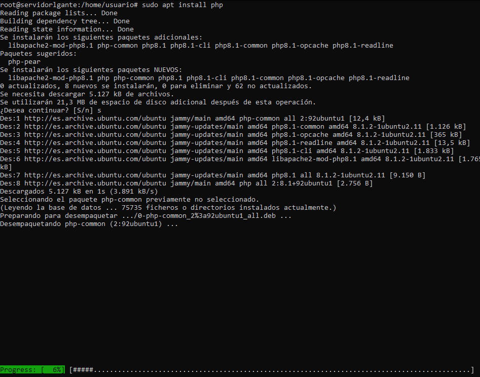
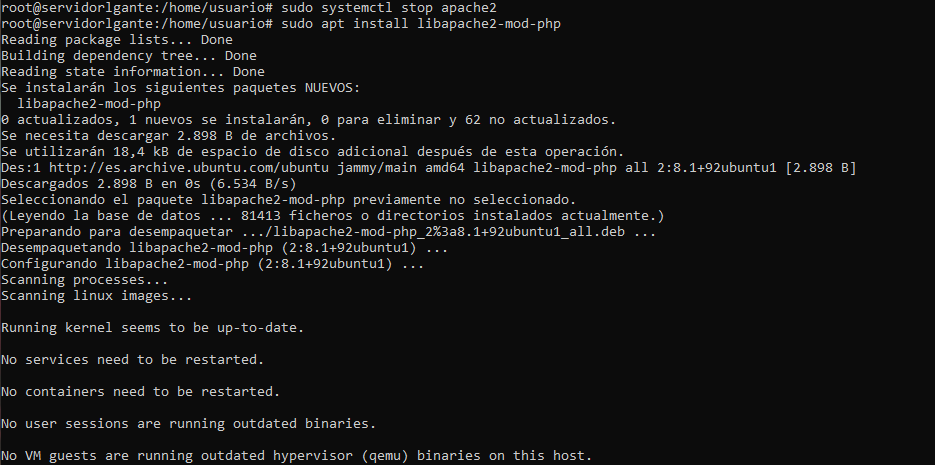
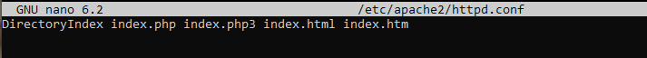
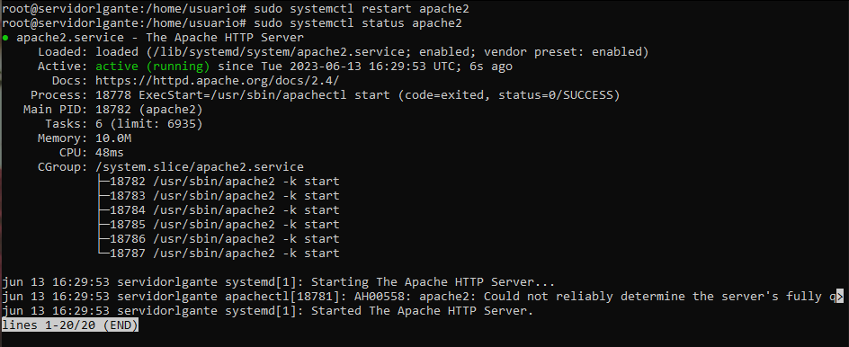

## Paso 1: Actualiza el sistema
Antes de comenzar, asegúrate de tener tu sistema Ubuntu actualizado. Abre una terminal y ejecuta los siguientes comandos

- sudo apt update
- sudo apt upgrade

## Paso 2: Instala Apache
Si aún no tienes Apache instalado, puedes hacerlo con el siguiente comando:

Después de la instalación, Apache debería iniciarse automáticamente. Puedes verificarlo ingresando la dirección IP de tu servidor en un navegador web y ver si aparece la página predeterminada de Apache.

## Paso 3: Instala PHP y los módulos necesarios
Para instalar PHP y los módulos requeridos, ejecuta el siguiente comando:

## Paso 4: Crear archivo de configuracion de apache
para establecer los valores de la opcion DirectoryIndex ejecutando el siguiente comando y modificando el archivo:

## Paso 5: A continuación reinicia Apache 
y comprueba el estado del servicio mediante el siguiente comando:

