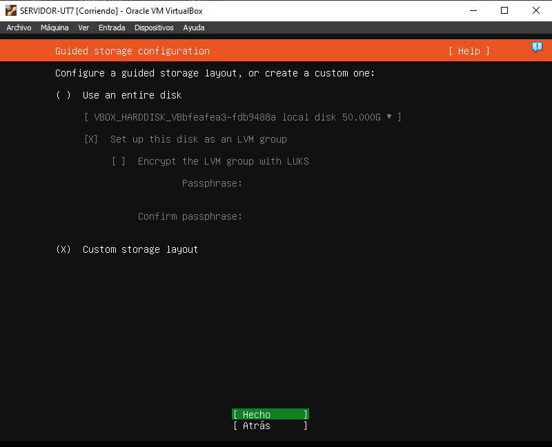
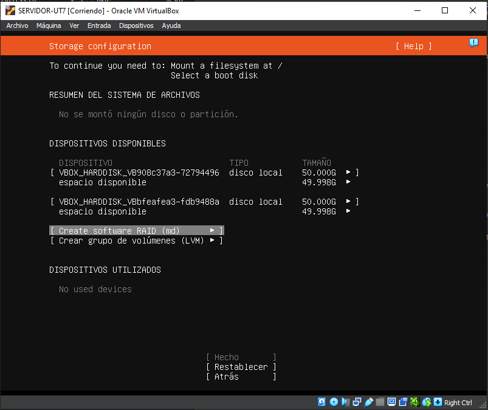
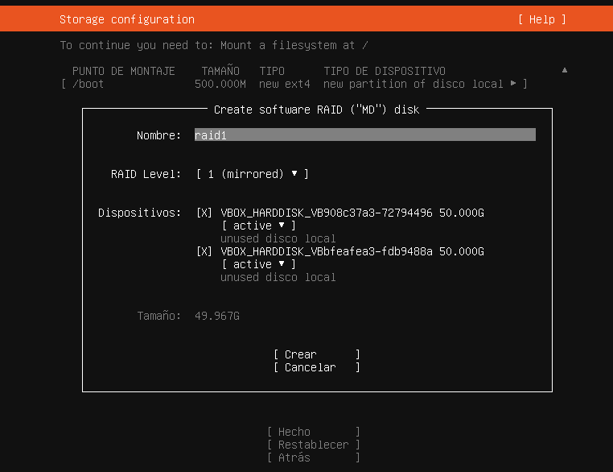
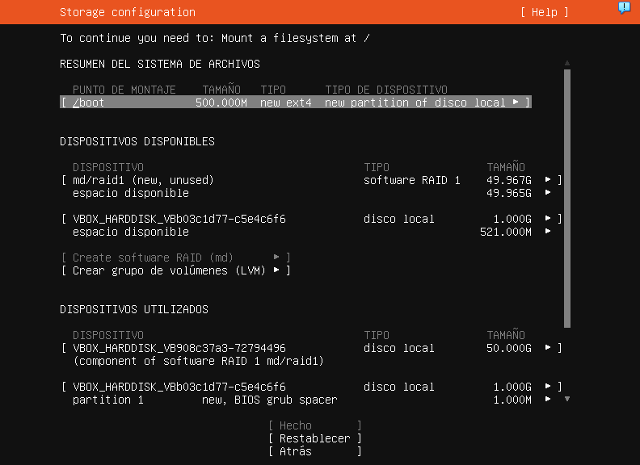
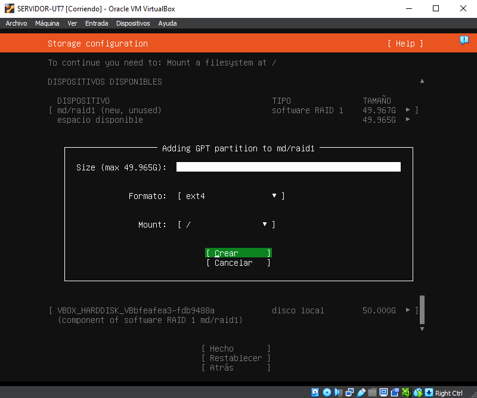
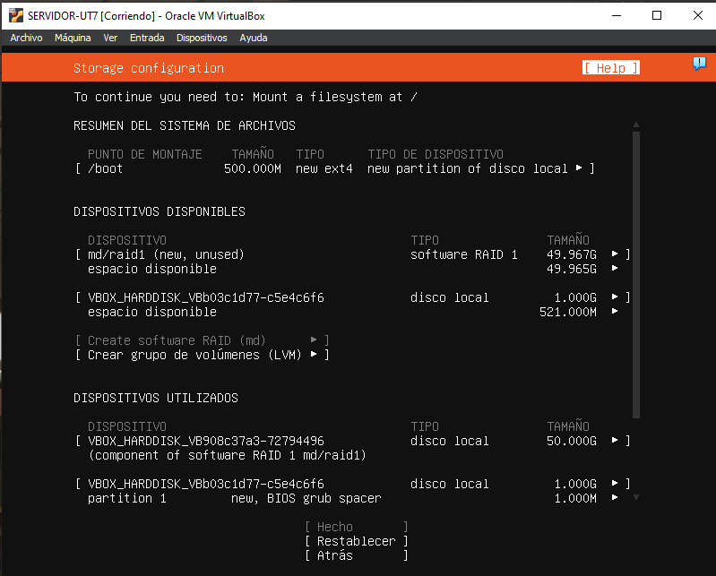
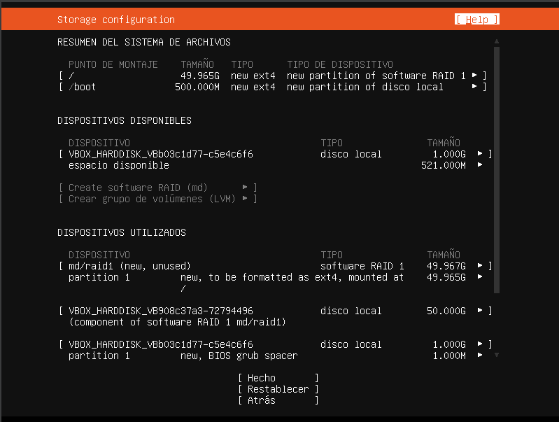

## Paso 1: Se escoge la opcion "Custom storage layout"
con esta opcion podremos crear el Raid con el disco que hemos añadido en primer lugar, el disco debe ser del mismo tamaño.

## Paso2: "Create software RAID"
Debemos crear el Raid 1 con el disco que hemos añadido para tener una copia de seguridad fisica de los archivos de nuestro servidor.

## Paso3: Se crea una particion a ¨/" 
Con el nuevo disco se crea una particion en la raiz para que haga la copia desde la raiz del sistema.

## Paso4: Se debe crear una particion boot
Una vez hecho el raid debemos crear la particion boot para que el sistema funcione si no tendremos problemas con el inicio

