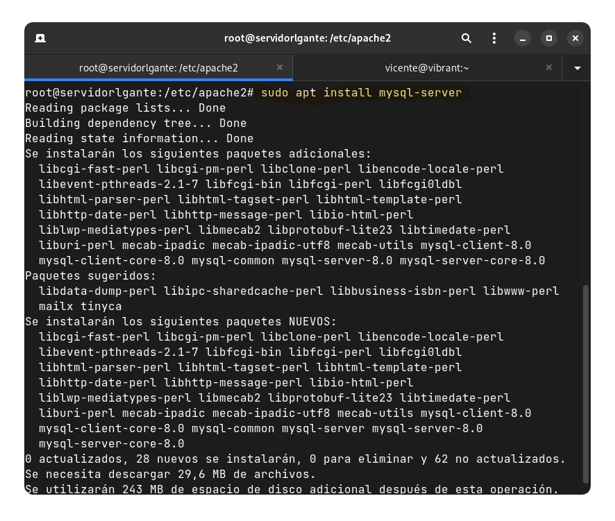
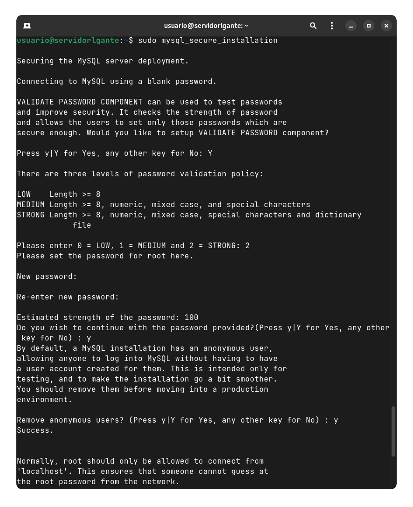
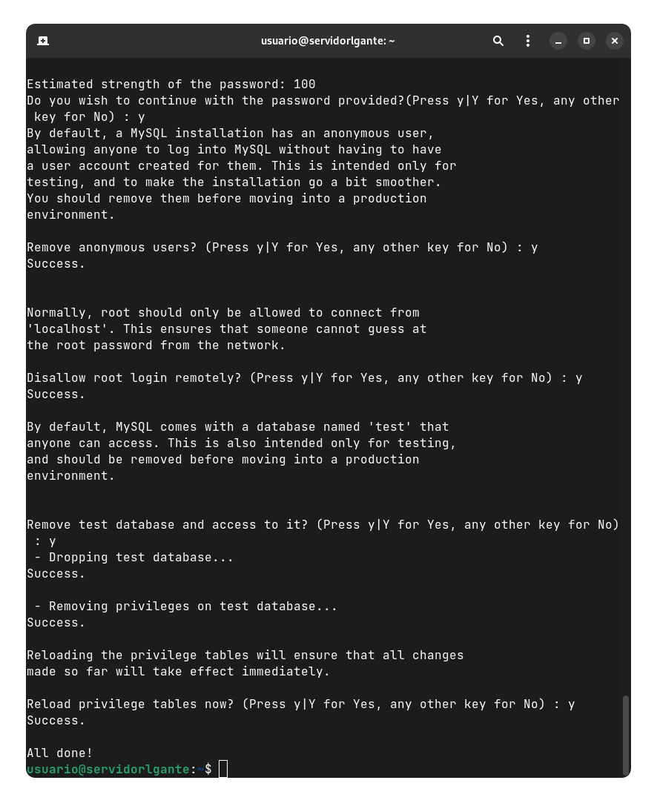
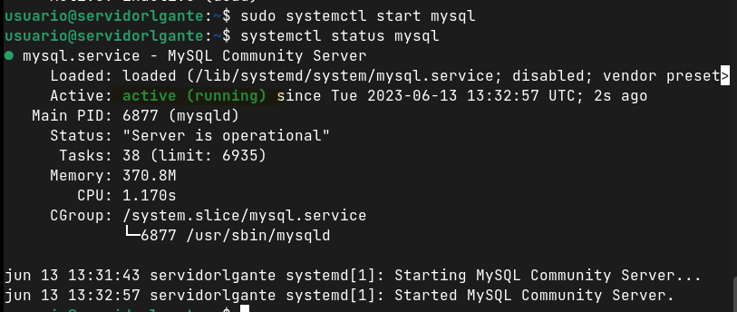

MySQL es un sistema de gestión de bases de datos relacionales (RDBMS, por sus siglas en inglés) ampliamente utilizado y altamente confiable. Fue desarrollado originalmente por MySQL AB, pero desde 2008 es propiedad de Oracle Corporation. MySQL se destaca por ser de código abierto, lo que significa que su código fuente está disponible para que cualquiera lo pueda utilizar, modificar y distribuir.

MySQL permite a los usuarios almacenar, organizar y acceder eficientemente a grandes cantidades de información estructurada. Utiliza el lenguaje de consulta estructurado (SQL) para interactuar con la base de datos y ejecutar operaciones como crear, modificar y eliminar tablas, así como realizar consultas para recuperar y manipular datos.

## Paso 1:

Utilizamos el comando `sudo apt install mysql-server`

## Paso 2:

A continuación usamos le comando `sudo mysql_secure_installation` para realizar una instalación de forma segura preparada para un entorno real.

1. Nos preguntará si queremos habilitar el componente que comprueba contraseñas escribimos `Y`.
2. A continuación establecemos le nivel de seguridad de la contraseña a **2**.
3. Escribimos una contraseña segura con letras, numeros y símbolos.

## Paso 3:

Le damos a todo Y.

## Paso 4:

Comprobamos que está instalado con el comando `systemctl status mysql` que nos muestra que está correctamente funcionando.

# Securización

Se instala MySQL de forma segura con el comando `mysql_secure_installation`, esto hace que no sea necesario securizar este servicio. Se establece una contraseña segura para el usuario root, se desactivan los usuarios anónimos y se eliminan los datos y privilegios de prueba.
