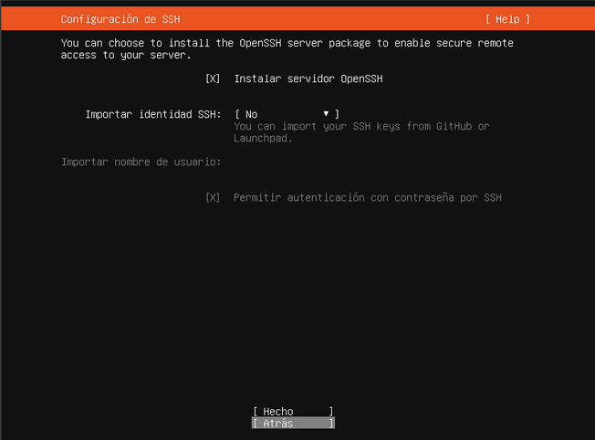
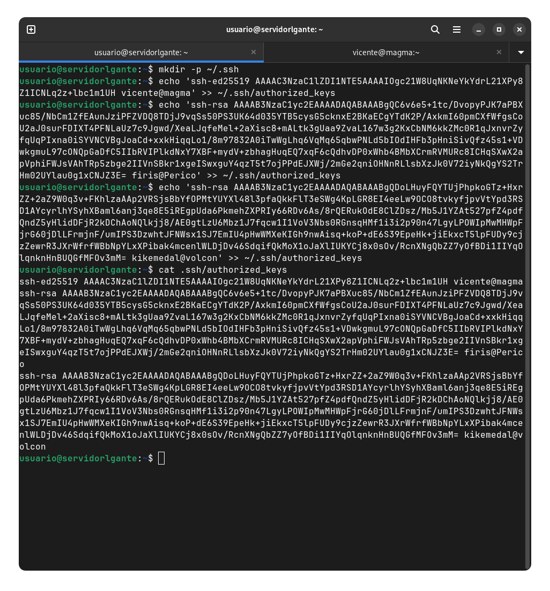
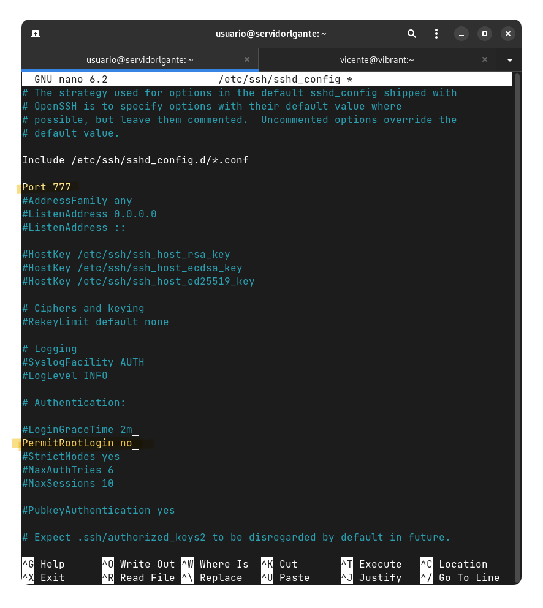
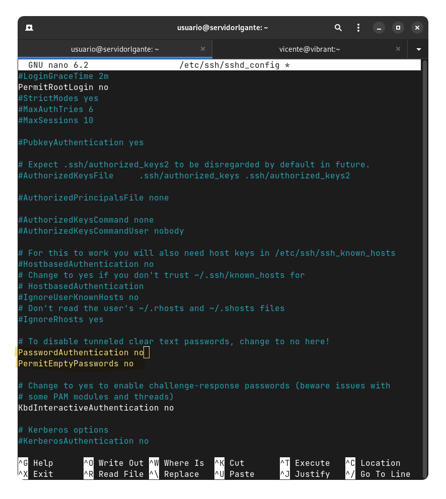

SSH (Secure Shell) es un protocolo de red seguro que permite el acceso remoto a sistemas y la transferencia segura de datos. Proporciona una forma encriptada de comunicación entre dos dispositivos, lo que garantiza la confidencialidad e integridad de la información transmitida.

Mediante SSH, los usuarios pueden iniciar sesión de forma remota en un servidor o dispositivo y ejecutar comandos de forma segura a través de una conexión cifrada. Esto es especialmente útil para administrar servidores o acceder a recursos de manera segura desde ubicaciones remotas.

## Paso 1

En el anterior [tutorial de instalación de Ubuntu con RAID1](guides/ubuntu.md) indicamos la instalación de SSH.

## Paso 2

Añadimos nuestras claves públicas al `authorized_keys`.

## Paso 3

Luego accedemos al archivo de configuración del ssh y lo que hacemos es habilitar el puerto 777 y deshabilitar el login del root, además deshabilitamos la autenticación de contraseña para entrar con las claves de los PC que escribimos anteriormente.

## Paso 4

